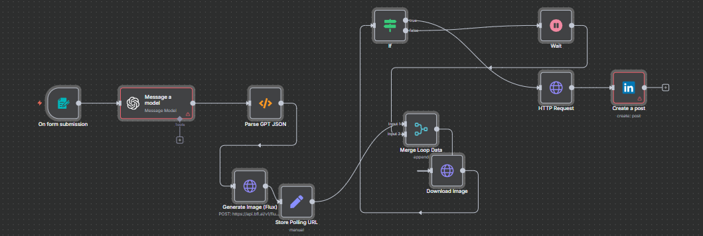

#  LinkedIn Post Automation (n8n + OpenAI + Flux)

The **LinkedIn Post Automation Workflow** is built in **n8n** and powered by **OpenAI GPT**.  

It automatically generates post content, creates images via **Flux image generation API**, and publishes the final post to **LinkedIn**.

---

##  Workflow Functionality

- Accepts **content ideas** via form submission  
- Uses **OpenAI GPT model** to generate LinkedIn-ready content  
- Generates AI-based images using **Flux**  
- Downloads and merges image data for publishing  
- Automatically posts to **LinkedIn**  
- Handles waiting & polling until images are ready  

---

##  Workflow Preview

---

##  Setup Instructions

1. **Import the Workflow**  
   - In n8n, click **Import** → upload `LInkedin automation.json`  

2. **Configure Credentials**  
   - **OpenAI API Key** → for GPT content generation  
   - **Flux API Key** → for image generation  
   - **LinkedIn API Integration** → for publishing posts  

3. **Customize**  
   - Adjust system prompts for post style (e.g., professional, casual)  
   - Change LinkedIn post target (personal profile or company page)  
   - Modify form input for specific use cases  

---

##  Example Use Cases

- Auto-generate and post **LinkedIn updates** with visuals  
- Marketing teams scaling content publishing  
- AI-assisted **content + image creation pipelines**  

---

##  Requirements

- Running **n8n** instance (local or hosted)  
- **OpenAI API Key**  
- **Flux API Key** for image generation  
- **LinkedIn Developer Access/API**  

---

##  Contribute or Extend

Fork and extend this project for:

- Multi-platform posting (Twitter, Medium, Instagram)  
- Scheduling & analytics integration  
- Multi-language support  

---
